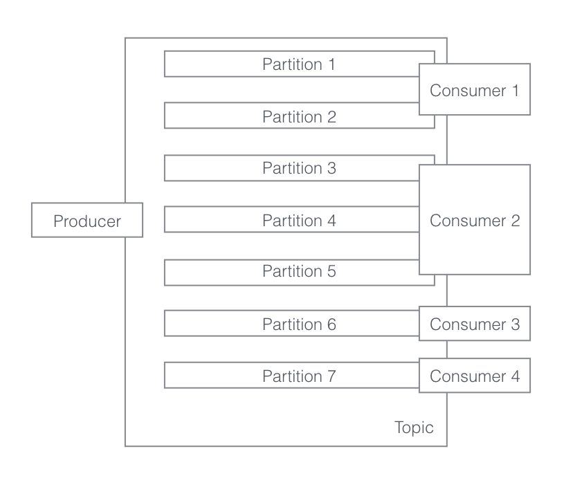
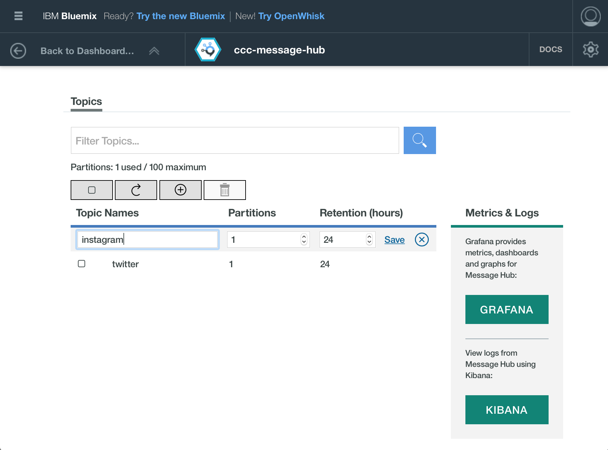

# Message Hub Example Code

IBM Message Hub is a [Bluemix](https://console.ng.bluemix.net) managed instance of [Apache Kafka](http://kafka.apache.org), a massively scalable message queue, architected as a distributed transaction log. Kafka was originally developed at LinkedIn before being open sourced.

## Message Hub Terminology

### Producers
Producers are responsible for putting data on to Message Hub, publishing messages to a specific topic.

### Topics
Topics are used to organise data in to different queues. Messages are sent to a specific topic with a producer and received via a consumer.

### Partitions
Partitions are used to subdivide a topic. A partition effectively provides another queue, adding scalability (storage and throughput) to a topic without the developer having to deal with the underlying infrastructure. Partitions are required to load balance messages between different consumers in a consumer group.

### Consumers
Consumers are responsible for taking messages from Message Hub on a specific topic.  Each consumer instance is given a unique client ID.

### Consumer Groups
Consumer groups organise consumer instances into groups. Grouping consumers allows for load balancing to take place between instances.

## Example Code
The following Java code shows how to send and receive messages from Message Hub using the standard [Apache Kafka API](http://kafka.apache.org/documentation.html#api).

### Producer.java
Producer.java creates a Kafka producer and adds a new message to Message Hub every second.

    KafkaProducer<String, String> kafkaProducer = new KafkaProducer<String, String>(properties);

    ...

    while(running){
			try {
				Date now = new Date();
				String message = now.toString();
				ProducerRecord<String,String> producerRecord = new ProducerRecord<String,String>(topic, message);
				kafkaProducer.send(producerRecord);
				logger.log(Level.INFO,"Added: " + message);
				Thread.sleep(1000);
			}
			catch (final Exception e) {
				logger.log(Level.ERROR, "Producer has failed with exception: " + e);
			}
		}

### Consumer.java
Consumer.java creates a Kafka consumer and reads messages from the queue. After reading a set of messages it sends a commit instruction via the Kafka consumer, this allows Message Hub to know which messages have been read by this consumer group.

    KafkaConsumer<String,String> kafkaConsumer = new KafkaConsumer<String, String>(properties);

    ...

    while(running){
      try {
        Iterator<ConsumerRecord<String, String>> it = kafkaConsumer.poll(10000).iterator();
        kafkaConsumer.commitSync();
        while (it.hasNext()) {
          count++;
          ConsumerRecord<String, String> record = it.next();
          logger.log(Level.INFO, "Value: " + record.value() + " Count:"+count);
        }

      }
      catch (final Exception e) {
        logger.log(Level.ERROR, "Consumer has failed with exception: " + e);
      }
    }

### Editing configuration
The example code uses two configuration files.  

Kafka properties for both consumers and producers are set in *resouces/kafka.properties*, including the name of the topic to use (cscc.topic). All of the consumers and producers in the examples use this same configuration file.

Only one producer is used in this example. Its configuration can be set by copying *local-producer.env.template* to *local-producer.env* and filling in the Message Hub username and password taken from the Bluemix dashboard.

Two consumers are used in this example. Their configuration can be set by copying local-consumer-1.env.template to local-consumer-1.env and local-consumer-2.env.template to local-consumer-2.env and filling in the Message Hub username and password taken from the Bluemix dashboard.  The consumer properties files allow the consumer group to be set, this will be changed depending on how Message Hub is being used (see below).

### Setting up Topic
A new Message Hub instance can be created using the Bluemix dashboard. Search the catalog for *Message Hub* and create a new instance of the service. You'll need to give the service a name and create some credentials. Once created, you'll be able to access the user name and password though the Service Credentials panel in the Bluemix dashboard.

Topics need to be created before they can be used, also through the dashboard.

When creating a topic, you need to specify two properties: the maximum time period messages will stay on that queue for and how many partitions should be used for the topic. A Message Hub partition is currently limited to 1GB of data. Once full, the oldest messages will be removed to make way for new ones.

### Building and running examples
The code can be built using the build.sh script if the development machine has Java 7, Maven and Gradle installed.  

        ./build.sh

The code can also be built via a Vagrant virtual machine preconfigured with Java, Maven and Gradle.

        vagrant up
        vagran ssh
        cd /vagrant
        ./bulid.sh

### Single Consumer Example
Message Hub acts as buffer with the producer and consumer decoupled. The consumer will process messages as quickly as it can, but wont be overloaded with input data. The consumer can disconnect and it will get data from where it left off (last commit) in the queue when it reconnects.

        ./start-producer.sh
        ./start-consumer-1.sh

### Multiple Consumers, Different Consumer Group Example
Message Hub working on publish-subscribe model. Each consumer receives all messages. If one cosumer disconnects and reconnects it will carry on from where it left off.

* Set each consumer to have a unique client ID.
* Set each consumer to have a unique consumer group name.

        ./start-producer.sh
        ./start-consumer-1.sh
        ./start-consumer-2.sh

### Multiple Consumers, Same Consumer Group Example
Message Hub delivers each message to just one instance in a given consumer group. This can be used for load balancing. The default behavior is round-robin, but can be defined through the API.

You must have at least as many partitions as there are consumer groups to load balance across. It is ok to have more partitions than consumer groups as a single consumer group can span multiple partitions.

* Set each consumer to have a unique client ID.
* Set each consumer to have the same consumer group name.

        ./start-producer.sh
        ./start-consumer-1.sh
        ./start-consumer-2.sh

### Single Consumer, New Consumer Group Example
With Message Hub you can change the position in the queue that processing should start from. The default is to process from the last committed message, but this can be reset to the beginning (or anywhere else) through the API. Alternatively, a new consumer group (commits are stored against a consumer group) can be used. If there is a new consumer group, Message Hub uses the auto.offset.reset configuration property to work out where in the queue to start from (e.g. earliest).

This configuration can be made use of in a [Lambda](https://en.wikipedia.org/wiki/Lambda_architecture) or [Kappa](ttp://milinda.pathirage.org/kappa-architecture.com/) architecture where a transaction log is used as the data store. Values are calculated by processing the full queue of transaction.

* Set consumer-1 to have a new consumer group name, that's not been used before.
* Leave consumer-2 with its existing consumer group name.
* Set auto.offset.reset Kafka property to earliest.

        ./start-producer.sh
        ./start-consumer-1.sh
        ./start-consumer-1.sh

## References
* https://console.ng.bluemix.net/docs/services/MessageHub/index.html#messagehub
* https://developer.ibm.com/messaging/message-hub/
* http://kafka.apache.org
* https://en.wikipedia.org/wiki/Apache_Kafka
* http://techblog.netflix.com/2016/04/kafka-inside-keystone-pipeline.html
* https://eng.uber.com/streamific/
* https://en.wikipedia.org/wiki/Lambda_architecture
* http://milinda.pathirage.org/kappa-architecture.com/
